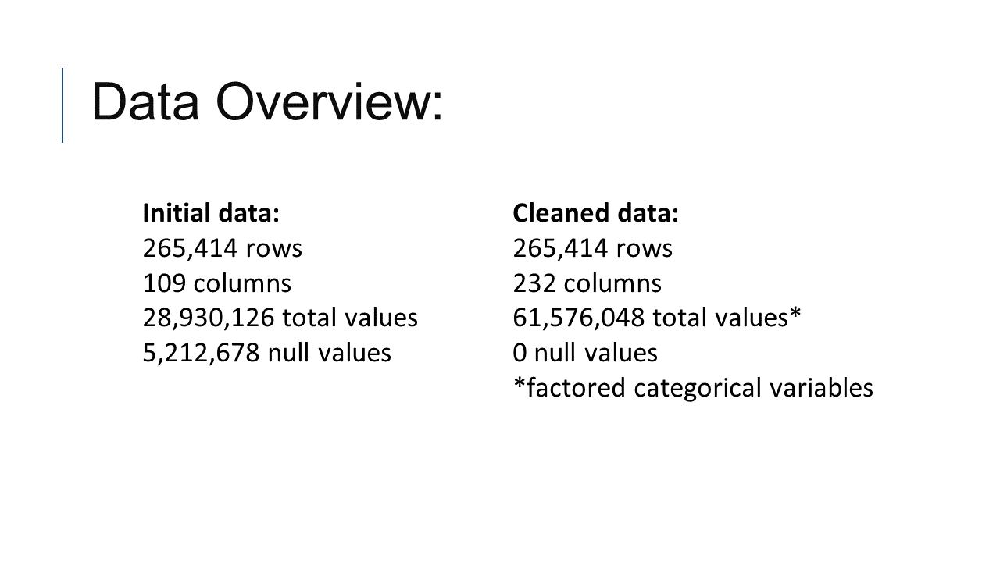
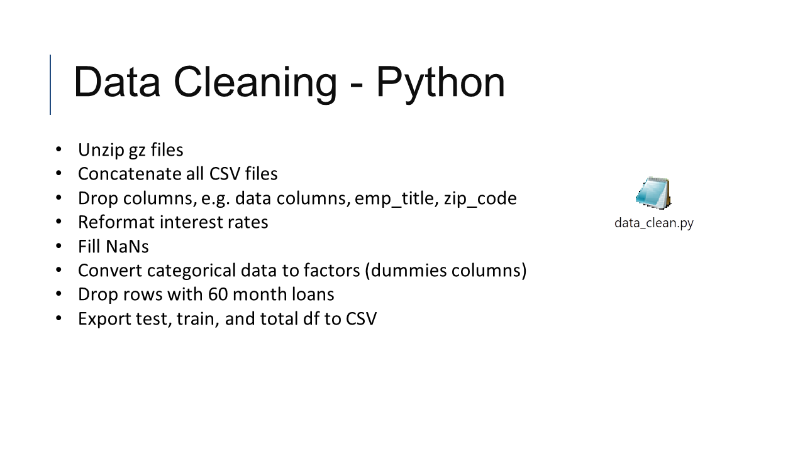
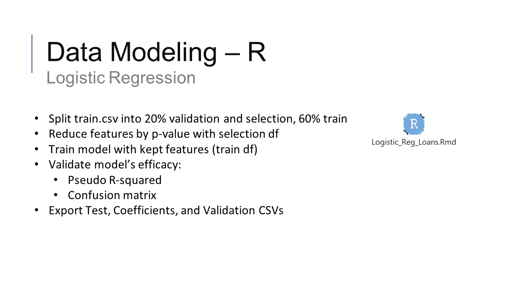
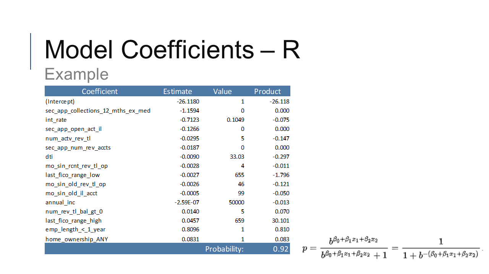
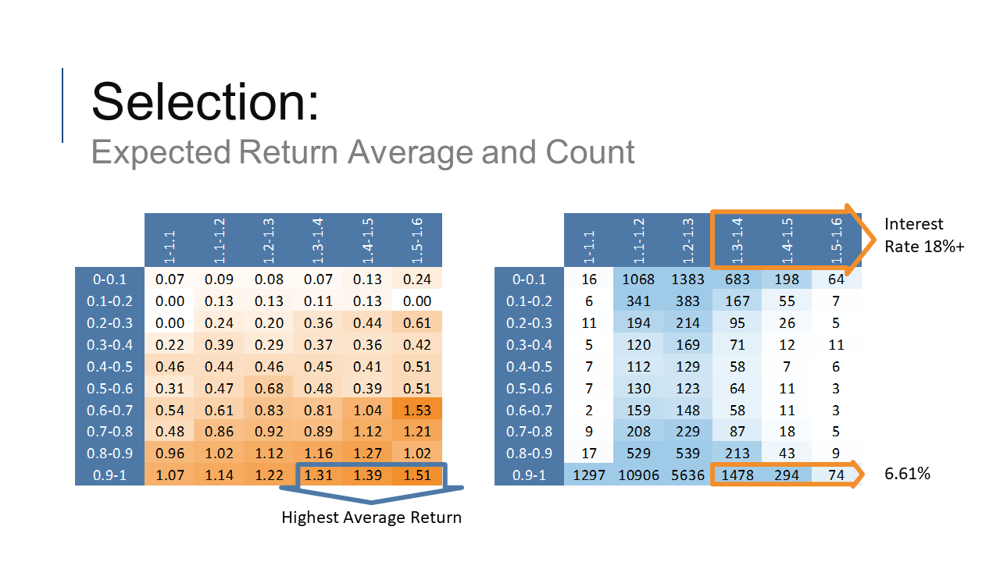
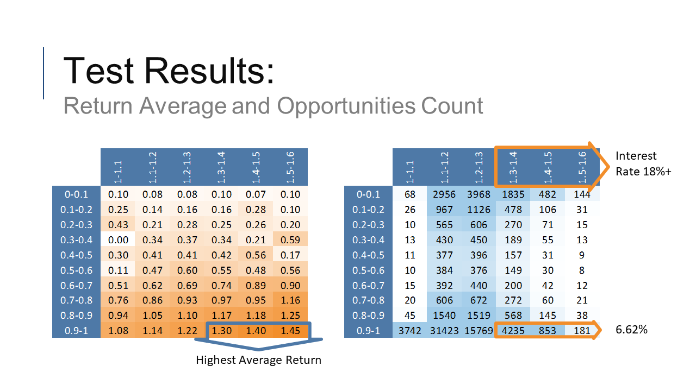
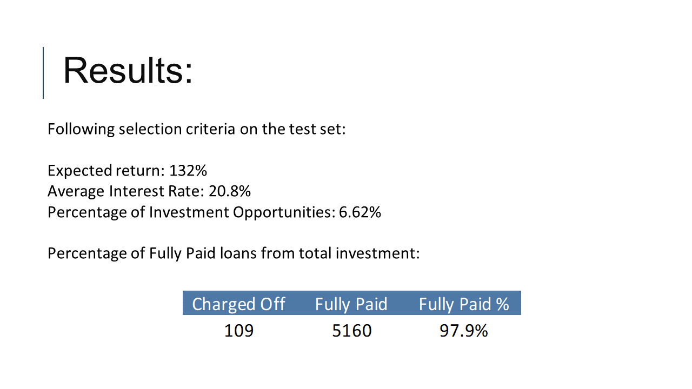

DATA CHALLENGE

Thank you for your interest in Data Science at Brightside! The next step in the process is 
a data challenge. The goal for us is to get an understanding of how you approach and think about
problems, and how you work with data. While the deliverable includes a machine learning model, the 
evaluation is much deeper than that -- we care about how you're getting to that final state, your logic, 
and your code.  

This repository has 2 years worth of Lending Club loan files stored in the data/ directory. 
These files are quarterly, and have data on loans that Lending Club has 
issued (date, amount, term, interest rate), metadata about the customer who took them 
out (such as employment, annual income, FICO), and the loan status. There is a data dictionary stored
in the docs/ directory.

Goal: build a model that informs the user which loans they should invest in.

Model Usage: Your goal is to inform investors on the best loans. This means: I am going to Lending Club and 
ready to invest $100. There is a list of loans on their site (which have not
yet been funded) that I get to choose from, and I want to know which ones are the best to invest in.
Keep that goal in mind as you build your feature set and final solution.

To get started, clone this repository, make the repository you're working on private,
and add me as a collaborator.

There is no time limit on this challenge -- it is up to you
to balance between taking your time and trying various methods you choose, but not
take too long, and allow other applicants to get the chance for a final interview first.
When you have completed the data challenge, send me an email at 
brett.nebeker@gobrightside.com to let me know it's ready to be reviewed. You can use this 
same email address if you have any questions. 

NOTE: if you are applying for the data science analyst position, 
the focus of the role is more data analytics/visualization work. Therefore, it would
be beneficial for you to focus more of your energy on the early stages of the data science flow
(cleaning, EDA, etc), whether in Python or Tableau. The ML model is optional.

Have fun!

